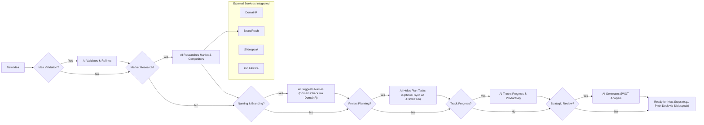
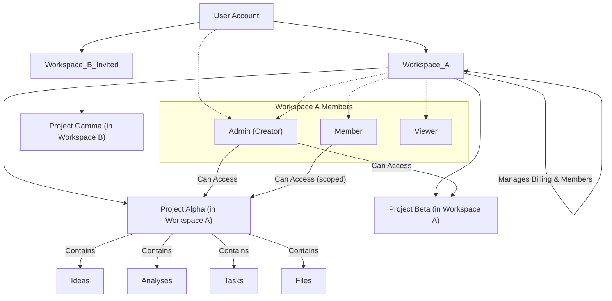
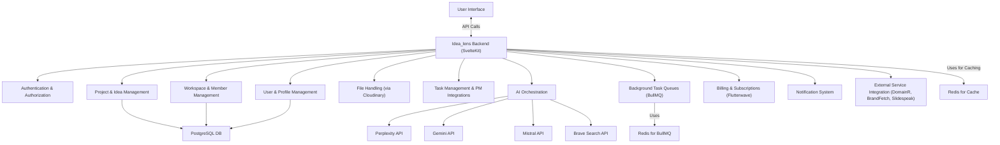

# Product Brief: Idea_lens - Your AI Software Development Partner

## 1. What is Idea_lens? (The Big Picture)

Imagine having an incredibly smart assistant 🧠 dedicated to helping you turn your software ideas into successful realities. That's **Idea_lens**!

It's a platform designed to support you at every step of building software – from the first spark of an idea, through researching the market, planning your project, and even getting it ready for the world. Idea_lens uses smart AI to do the heavy lifting, provide insights, and keep you organized, so you can focus on creating.

**For Frontend Developers:** Think of the backend as the powerful engine and central brain ⚙️ of Idea_lens. It's what you'll "talk to" via API calls to make the user interface come alive with data, insights, and actions.

## 2. The User's Journey: How Idea_lens Helps

Idea_lens is built around a flow, allowing users to pick and choose the help they need based on where they are in their project journey.

**Core Goal:** To take a raw idea 💡 and transform it into a well-defined, market-aware, and planned software project 🚀.

Here's a visual representation of the typical user journey:

Let's break down each step:

### a. Starting with an Idea: "I have this cool concept..."
*   **User Action:** The user types out their software idea, uploads a document 📄 explaining it, or even shares links 🔗 to similar concepts.
*   **Backend Magic:**
    *   Securely stores this initial "raw data."
    *   **Idea Validation:** Our AI assistant (think of it as a very experienced product analyst) reads through everything.
        *   *(AI used: Gemini).*

### b. Understanding the Landscape: "Is this idea viable? Who else is doing this?"
*   **User Action:** The user asks Idea_lens to research the market or analyze competitors.
*   **Backend Magic:**
    *   **Market Research:** Our AI research specialist (Perplexity Sonar or Brave Search) scours the web.
    *   **Competitor Analysis:** The AI identifies existing solutions.
        *   It can automatically try to fetch their **company logos** (using **BrandFetch**) if the user provides competitor websites. 🖼️
    *   *(AI used: Perplexity, Brave Search, Gemini. Helper Service: BrandFetch).*

### c. Naming and Branding: "What should I call it?"
*   **User Action:** The user wants help finding a great name for their project or product.
*   **Backend Magic:**
    *   Our creative AI assistant (Mistral or Gemini) generates a list of potential names.
    *   For each suggested name, Idea_lens can instantly check **domain name availability** (using **DomainR**). ✅
    *   *(AI used: Mistral, Gemini. Helper Service: DomainR).*

### d. Planning the Work: "Let's get organized."
*   **User Action:** The user wants to break down their project into manageable tasks. They might use Idea_lens's built-in tools or connect their favorite project management app (like GitHub Projects or Jira 🔄).
*   **Backend Magic:**
    *   Provides a simple interface to create and manage tasks.
    *   **AI-Assisted Task Creation:** The AI can suggest tasks.
    *   **Integration Power:** Securely connects to external tools.
    *   *(AI used: Simpler AI for task suggestion).*

### e. Staying on Track: "How are we doing?"
*   **User Action:** The user wants to see progress.
*   **Backend Magic:**
    *   Tracks contributions and task completions (if integrated).
    *   Provides charts and reports 📊.
    *   **AI-Powered Insights (Code Review/Summary):** AI can look at code changes in GitHub and summarize.
    *   *(AI used: Gemini for code/productivity).*

### f. Strategic Thinking: "What are our Strengths and Weaknesses?"
*   **User Action:** The user wants a strategic overview.
*   **Backend Magic:**
    *   Our strategic AI assistant generates a SWOT analysis (Strengths, Weaknesses, Opportunities, Threats).
    *   *(AI used: Gemini).*

### g. Creating a Pitch: "I need to present this idea!" (Future Feature)
*   **User Action:** The user wants to generate a pitch deck プレゼンテーション.
*   **Backend Magic:**
    *   Gathers key information.
    *   Sends data to Slidespeak API and retrieves the presentation.
    *   *(Integration with Slidespeak API).*

## 3. How It's Organized: Workspaces, Projects, and People

To keep things neat, Idea_lens uses a clear structure:

*   **Users:** Individuals sign up.
*   **Workspaces:** A user can create or be invited to `Workspaces` (like a company or team folder).
    *   Billing (via Flutterwave 💳) is tied to a workspace.
    *   Users invite others with roles (Admin, Member, Viewer).
*   **Projects:** Inside a workspace, users create `Projects` (specific software ideas).
    *   Features happen *within* a project.

**Backend's Role:** Manages accounts, relationships, billing, and permissions.

## 4. Handling Complex Tasks: The "Behind-the-Scenes" Workers ⚙️➡️📦

Some tasks take time. Instead of making the user wait, the backend is smart:

1.  **User Request** (e.g., "Analyze market") 🙋‍♂️➡️🖥️
2.  **Backend Acknowledges** ("Okay, I'm on it!") 🖥️👍
3.  **Task Handed Off** to a Background Worker 🖥️➡️👷‍♂️ (BullMQ Queue)
4.  **Worker Processes Task** (e.g., AI analysis, external API calls) 👷‍♂️...⏳
5.  **Results Saved** 💾
6.  **User Notified** (Optional) 📲

**For Frontend Developers:** For some API calls, you'll get an "accepted" response, and you'll need to check for results later.

## 5. The Smart Helpers: AI & Other Services 🤝

Idea_lens uses a team of specialized assistants:

### AI Assistants 🤖:
*   **The Deep Researcher (Perplexity Sonar):** 🕵️‍♂️ For web research.
*   **The Big Thinker (Gemini 1.5/2.5):** 🧐 For complex analysis, documents, code.
*   **The Quick Helper (Mistral AI):** ⚡ For fast tasks, suggestions.
*   **The Current Events Expert (Brave Search API):** 📰 For real-time trends.

The backend's "AI Orchestrators" 🧑‍🏫 act like conductors, choosing the right AI for each task.

### Other Helper Services 🛠️:
*   **DomainR Service:** Checks domain availability (e.g., `yourname.com`?).
*   **BrandFetch Service:** Fetches company logos 🖼️.

## 6. What the Backend Manages Overall (The Central Hub)

*   User accounts, profiles, settings.
*   Workspaces, members, roles.
*   Projects, their data.
*   Connections to external tools & helper services.
*   AI analysis results.
*   Subscription plans & billing.
*   Notifications.
*   Secure data storage.
*   Efficient task handling.