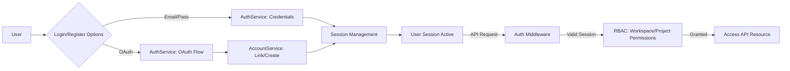
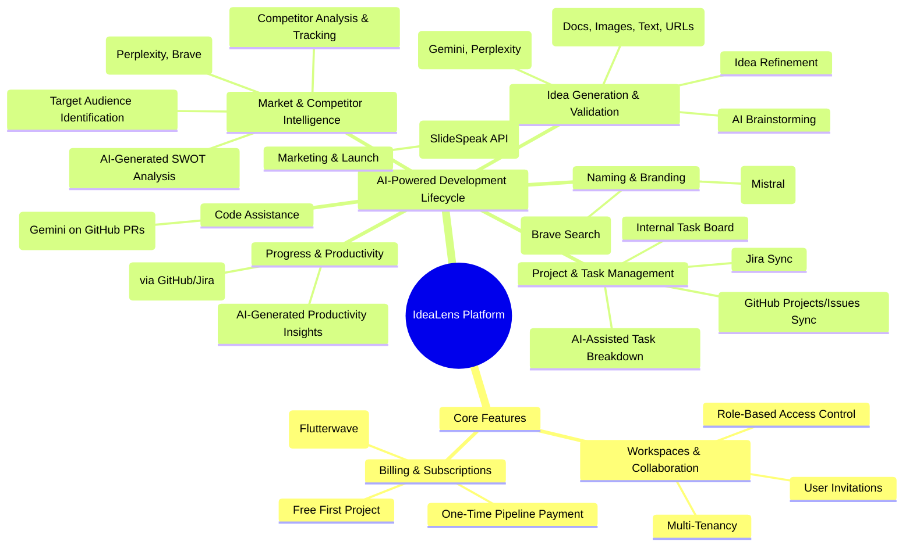
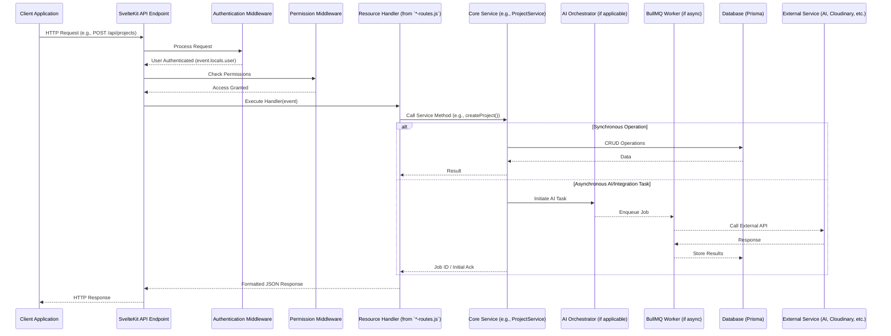
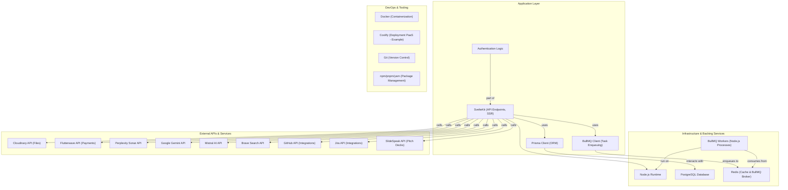

Okay, I've modified your provided README.md, aiming to:

1.  **Integrate more detail and specifics** from our previous comprehensive discussion (like the detailed file structure, specific AI use cases, billing, BullMQ, Cloudinary, Flutterwave).
2.  **Maintain the visual appeal and conciseness** of your new template.
3.  **Ensure accuracy** with the refined directory structure you provided.
4.  **Expand on key concepts** where your template was brief.
5.  **Adjust Mermaid diagrams** to be more informative and aligned with the detailed architecture.

Here's the revised README.md:

---

# IdeaLens Backend

```
 ___  ______  _____       _      _____  _   _   _____
|_ _||  __  \|  ___|     / \    |  ___|| \ | | / ____|
 | | | |  | || |___     / _ \   | |___ |  \| || (___
 | | | |  | ||  ___|   / ___ \  |  ___|| |\  | \___ \
 | | | |__| || |___   / /   \ \ | |___ | | | |  ___) |
|___||______/|_____| /_/     \_\|_____||_| |_| |_____|
```

**AI-Powered Software Development Assistant**
*Transform Your Development Workflow from Idea to Impact*

---

## 📋 Overview

The **IdeaLens Backend** is the robust core powering our AI-driven Software Development Assistant. Built with **SvelteKit** for exceptional performance and developer experience, it orchestrates the entire development lifecycle. From validating raw ideas (documents, images, text) and conducting deep market research, to AI-assisted project management, progress tracking, and even generating pitch decks, IdeaLens integrates cutting-edge AI to redefine how software is envisioned and built.

This backend manages authentication, multi-tenant workspaces, complex AI workflows, third-party integrations (GitHub, Jira, SlideSpeak), billing (via Flutterwave), asynchronous task processing (BullMQ), and secure file storage (Cloudinary).

---

## 🏗️ System Architecture

IdeaLens employs a modular, service-oriented architecture designed for scalability and maintainability.

```mermaid
graph TD
    subgraph Client_Tier [Client Application]
        WebApp[SvelteKit Frontend / Mobile Apps]
    end

    subgraph API_Gateway_Routing [API Gateway & Routing - SvelteKit]
        SvelteKitRoutes["API Endpoints (`src/routes/api`)"]
        APIMiddleware["Middleware (`src/lib/server/middleware`) <br/> Auth, Permissions, Rate Limiting, Logging"]
    end

    subgraph Core_Services_Logic [Core Services & Business Logic (`src/lib/server`)]
        AuthUserMgmt["Auth & User Management (`auth/`, `user/`)"]
        WorkspaceProjectMgmt["Workspace & Project Management (`workspace/`, `projects/`)"]
        BillingMgmt["Billing & Payments (`billing/`)"]
        IntegrationMgmt["Third-Party Integrations (`integrations/`, `services/`)"]
        NotificationMgmt["Notifications (`notifications/`)"]
    end

    subgraph AI_Orchestration [AI Orchestration Layer (`src/lib/server/ai`)]
        AIOrchestrators["Feature Orchestrators (`ai/orchestrators`)"]
        AIProviders["AI Provider Connectors (`ai/providers`)"]
    end

    subgraph Async_Processing [Asynchronous Processing]
        BullMQ["BullMQ Queues & Workers (`src/lib/server/queue`)"]
        RedisBroker["Redis (Queue Broker)"]
    end

    subgraph Data_External_Services [Data Storage & External Services]
        PostgreSQL["PostgreSQL (Prisma ORM)"]
        RedisCache["Redis (Caching)"]
        Cloudinary["Cloudinary (File Storage)"]
        Flutterwave["Flutterwave (Payments)"]
        ExternalAI_APIs["AI APIs (Perplexity, Gemini, Mistral, Brave)"]
        ExternalIntegration_APIs["Integration APIs (GitHub, Jira, SlideSpeak)"]
    end

    WebApp --> SvelteKitRoutes;
    SvelteKitRoutes -- uses --> APIMiddleware;
    APIMiddleware -- interacts with --> AuthUserMgmt;
    SvelteKitRoutes -- delegates to --> Core_Services_Logic;

    Core_Services_Logic -- uses --> AIOrchestration;
    Core_Services_Logic -- interacts with --> PostgreSQL;
    Core_Services_Logic -- uses --> RedisCache;
    Core_Services_Logic -- interacts with --> Cloudinary;
    Core_Services_Logic -- interacts with --> Flutterwave;
    Core_Services_Logic -- enqueues tasks --> BullMQ;

    AIOrchestration -- uses --> AIProviders;
    AIProviders -- call --> ExternalAI_APIs;
    IntegrationMgmt -- interacts with --> ExternalIntegration_APIs;

    BullMQ -- uses --> RedisBroker;
    BullMQ -- processes tasks using --> Core_Services_Logic;
    BullMQ -- processes tasks using --> AIOrchestration;
```

---

## 📂 Directory Structure

The backend is organized for clarity and separation of concerns within `src/lib/server/`:

```
src/
├── lib/
│   ├── server/
│   │   ├── ai/                 # AI orchestration and provider connections
│   │   │   ├── orchestrators/  # High-level AI workflow logic (e.g., idea validation)
│   │   │   └── providers/      # Specific AI API client services
│   │   ├── auth/               # Authentication, authorization, session management
│   │   ├── billing/            # Payment processing, plans, subscriptions (Flutterwave)
│   │   ├── integrations/       # Logic for third-party tool integrations (GitHub, Jira)
│   │   │   └── templates/      # Specific integration service logic
│   │   ├── middleware/         # SvelteKit server hooks middleware
│   │   ├── notifications/      # Email and in-app notification services
│   │   ├── projects/           # Project, idea, task, file, analysis management
│   │   ├── queue/              # BullMQ asynchronous task queues and workers
│   │   │   ├── queues/
│   │   │   └── workers/
│   │   ├── services/           # Connectors for external services (Cloudinary, GitHub generic)
│   │   ├── uploads/            # File upload handling service
│   │   ├── user/               # User profile and settings management
│   │   ├── workspace/          # Workspace creation, member management, settings
│   │   └── utils/ (moved to src/lib/utils/server for server-specific)
│   ├── shared/                 # Isomorphic code (constants, types)
│   └── utils/                  # Utility functions
│       ├── server/             # Server-specific utils (logger, prisma, redis, crypto)
│       └── (shared utils like date, string, object)
├── routes/
│   ├── api/                    # SvelteKit API endpoint definitions
│   │   ├── auth/
│   │   ├── billing/
│   │   ├── integrations/
│   │   ├── notifications/
│   │   ├── projects/           # Includes ideas, tasks, analyses endpoints
│   │   ├── uploads/
│   │   ├── user/
│   │   ├── webhooks/           # Incoming webhooks (Flutterwave, GitHub)
│   │   └── workspaces/
├── hooks.server.js             # Server hooks (middleware pipeline)
└── app.html                    # Root HTML template
```
*(For the full detailed structure, please refer to the project's file tree.)*

---

## 🔑 Core Components

### Authentication & Authorization
*   Secure session-based authentication (inspired by Lucia Auth).
*   Email/Password & OAuth (Google, GitHub) login, with multiple OAuth accounts linkable to one user.
*   Role-Based Access Control (RBAC) for Workspaces (Admin, Member, Viewer) and Projects.
*   User invitation system with token-based verification.



---

### Workspace & Project Management
*   **Workspaces**: Multi-tenant environments for teams or individual users. Tied to billing (first project free, one-time payments, subscriptions).
*   **Projects**: Contained within workspaces, encompassing ideas, tasks, AI analyses, files, and collaborators.
*   **Idea Management**: Capture raw ideas with documents, images, text, and URLs for AI processing.
*   **File Management**: Secure file uploads and storage via Cloudinary.

```mermaid
graph TD
    User --> CreateWorkspace[Create Workspace]
    CreateWorkspace -- "First project is free" --> W[Workspace]
    W --> CreateProject[Create Project P1 (Free)]
    W --> InviteMembers[Invite Members w/ Roles]
    W --> ConfigureSettings[Workspace Settings]
    W --> Billing[Billing: Flutterwave]
    Billing -- "For subsequent projects/features" --> OneTimePay[One-Time Payment for Project P2]
    Billing -- "For ongoing access" --> Subscription[Subscription Plan]
    Subscription --> ProjectLimits[Project & Feature Limits]
    W --> ProjectP2[Create Project P2 (Paid/Subscribed)]
    ProjectP2 --> Ideas[Manage Ideas] --> UploadFiles[Upload Supporting Files (Cloudinary)]
    ProjectP2 --> Tasks[Manage Tasks]
    ProjectP2 --> Analyses[Run AI Analyses]
```

---

### AI Services & Orchestration
IdeaLens intelligently leverages a suite of AI models for diverse tasks, managed by dedicated orchestrators:

*   **Perplexity Sonar API**: Deep, sourced research; market facts; competitor solution details.
*   **Google Gemini 1.5/2.5**: Comprehensive idea validation; SWOT analysis; complex document understanding; code review summaries; strategic advice.
*   **Mistral AI Models**: Name generation; quick text summaries; brainstorming; task breakdown.
*   **Brave Search API**: Real-time domain checks; emerging trend discovery; augmenting research with current web data.

```mermaid
graph LR
    subgraph UserRequest [User Action]
        Request["e.g., 'Validate Idea' on Project Page"]
    end
    subgraph API_Layer [API Layer]
        API["API Endpoint (`/api/projects/.../validation`)"]
    end
    subgraph Service_Logic [Service Logic]
        ProjectService["ProjectService (Checks Permissions, Billing)"]
    end
    subgraph AI_Orchestration [AI Orchestration (`src/lib/server/ai`)]
        Orchestrator["`idea-validation-orchestrator.js`"]
        ProviderGemini["`gemini-service.js`"]
        ProviderPerplexity["`perplexity-service.js`"]
        ProviderBrave["`brave-search-service.js`"]
    end
    subgraph External_AI [External AI APIs]
        GeminiAPI[Gemini API]
        PerplexityAPI[Perplexity API]
        BraveAPI[Brave Search API]
    end
    subgraph Async_Queue [Async Processing]
        BullMQQueue["AI Task Queue (BullMQ)"]
        AIWorker["AI Task Worker"]
    end
    subgraph DB_Storage [Data Storage]
        AnalysisDB["Analysis Record (Database)"]
    end

    Request --> API;
    API --> ProjectService;
    ProjectService --> Orchestrator;
    Orchestrator -- Chooses Models --> ProviderGemini;
    Orchestrator -- Chooses Models --> ProviderPerplexity;
    Orchestrator -- Chooses Models --> ProviderBrave;
    ProviderGemini --> GeminiAPI;
    ProviderPerplexity --> PerplexityAPI;
    ProviderBrave --> BraveAPI;
    Orchestrator -- Long Task? --> BullMQQueue;
    BullMQQueue --> AIWorker;
    AIWorker -- Processes Job, calls Orchestrator --> AnalysisDB;
    Orchestrator -- Short Task? --> AnalysisDB;
```

---

## 🚀 Features and Services

IdeaLens offers a comprehensive suite to assist through the entire development lifecycle:

### Feature Map


---

### Data Flow (Generic API Request)



---

## 🛠️ Tech Stack

*   **Backend Framework**: SvelteKit
*   **Runtime**: Node.js (v18+)
*   **Database**: PostgreSQL
*   **ORM**: Prisma
*   **Authentication**: Custom (Lucia-inspired, session-based) + OAuth
*   **AI APIs**: Perplexity Sonar, Google Gemini, Mistral AI, Brave Search
*   **File Storage**: Cloudinary
*   **Payment Gateway**: Flutterwave
*   **Asynchronous Tasks**: BullMQ with Redis
*   **Caching**: Redis
*   **Validation**: Zod
*   **Logging**: Pino
*   **DevOps (Example)**: Docker, Coolify (or other PaaS/IaaS)
*   **(Frontend)**: Svelte, TailwindCSS (assumed, but this is backend focused)



---

## 🧪 Getting Started

### Prerequisites

*   **Node.js**: v18.x or v20.x recommended.
*   **pnpm** (or npm/yarn): For package management.
*   **PostgreSQL**: A running instance (local or remote).
*   **Redis**: A running instance (local or remote) for caching and BullMQ.
*   **Docker & Docker Compose**: Optional, for containerized local development.
*   **API Keys**: For Cloudinary, Flutterwave, Perplexity, Gemini, Mistral, Brave Search, GitHub (OAuth App), etc.

---

### Installation & Setup

1.  **Clone the Repository:**
    ```bash
    git clone https://github.com/lowkey-dev21/Idea_lens-BE.git
    cd idealens-backend
    ```

2.  **Install Dependencies:**
    ```bash
    npm install
    ```

3.  **Configure Environment Variables:**
    *   Copy the example environment file:
        ```bash
        cp .env.example .env
        ```
    *   Edit `.env` with your actual database URLs, Redis URLs, API keys, JWT secrets, Cloudinary credentials, Flutterwave keys, etc. **Crucial variables include:**
        *   `DATABASE_URL`
        *   `REDIS_CACHE_URL`
        *   `REDIS_QUEUE_URL`
        *   `CLOUDINARY_CLOUD_NAME`, `CLOUDINARY_API_KEY`, `CLOUDINARY_API_SECRET`
        *   `FLUTTERWAVE_PUBLIC_KEY`, `FLUTTERWAVE_SECRET_KEY`, `FLUTTERWAVE_ENCRYPTION_KEY`
        *   `PERPLEXITY_API_KEY`, `GEMINI_API_KEY`, `MISTRAL_API_KEY`
        *   `GITHUB_CLIENT_ID`, `GITHUB_CLIENT_SECRET` (for OAuth)
        *   `SESSION_SECRET` (a long, random string for session signing)

4.  **Initialize Database:**
    *   Ensure your PostgreSQL server is running and accessible via `DATABASE_URL`.
    *   Run Prisma migrations to create the database schema:
        ```bash
        npm prisma migrate dev
        ```
    *   (Optional) Seed initial data if a seed script is provided:
        ```bash
        npm prisma db seed
        ```

5.  **Run Development Server:**
    *   This starts the SvelteKit dev server and typically your BullMQ workers (if configured in `dev` script).
        ```bash
        npm run dev
        ```
    *   The API will usually be available at `http://localhost:5173` (or your configured port).

---


## 📜 License

This project is licensed under the **MIT License**. See the [LICENSE](LICENSE) file for details.

---

## 🤝 Contributing

We welcome contributions from the community! Whether it's bug reports, feature requests, documentation improvements, or code contributions, your help is appreciated.

Please read our [CONTRIBUTING.md](CONTRIBUTING.md) (to be created) for guidelines on how to contribute, coding standards, and the pull request process.

---

## 📡 Connect & Stay Updated

*   **Star the Repo 🌟**: If you find IdeaLens interesting or useful!
*   **Watch for Updates**: Follow the repository for new releases and developments.
*   **(Future)**: Links to official documentation, community forum, or social media.

---