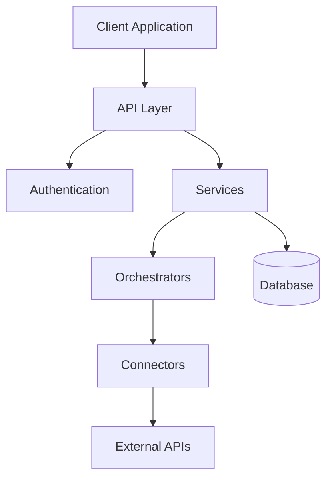
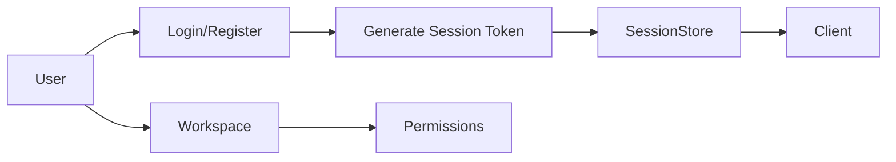
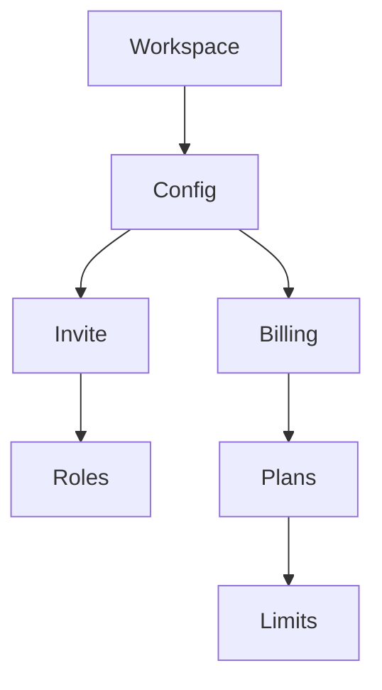
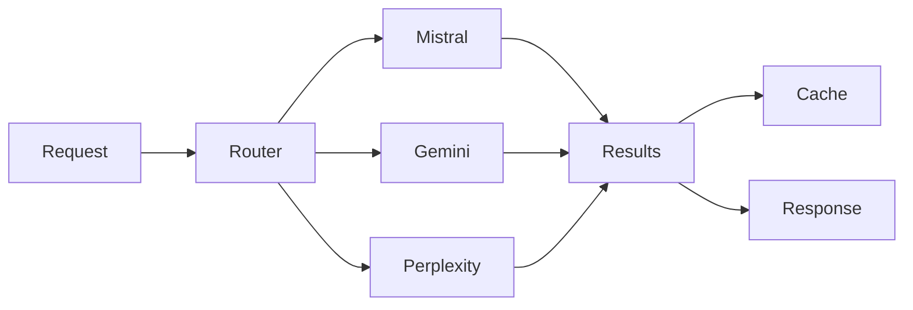
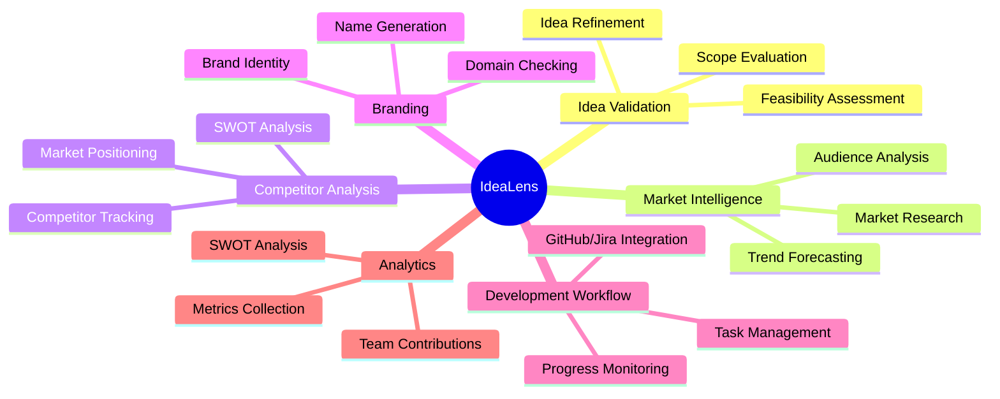
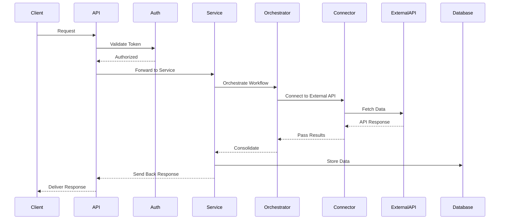
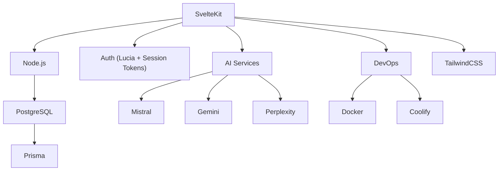

# IdeaLens Backend

```
 ___  ______  _____       _      _____  _   _   _____
|_ _||  __  \|  ___|     / \    |  ___|| \ | | / ____|
 | | | |  | || |___     / _ \   | |___ |  \| || (___  
 | | | |  | ||  ___|   / ___ \  |  ___|| |\  | \___ \
 | | | |__| || |___   / /   \ \ | |___ | | | |  ___) |
|___||______/|_____| /_/     \_\|_____||_| |_| |_____|
```

**AI-Powered Software Development Assistant**
*Transform Your Development Workflow with AI-Powered Insights*

---

## 📋 Overview

**IdeaLens Backend** serves as the core engine behind our AI-driven development assistant, crafted with **SvelteKit** to ensure speed, scalability, and a seamless developer experience.
It orchestrates authentication, workspace management, AI integrations, analytics, and more — redefining how teams innovate.

---

## 🏗️ System Architecture



---

## 📂 Directory Structure

```
src/
├── lib/
│   ├── server/
│   │   ├── auth/             # Authentication and session handling
│   │   ├── db/               # Database setup and utilities
│   │   ├── services/         # Core business logic
│   │   ├── orchestrators/    # Workflow management
│   │   ├── connectors/       # External API connections
│   │   ├── integrations/     # Third-party integrations
│   │   └── utils/            # Server-side utilities
│   └── shared/               # Universal shared code
├── routes/
│   ├── api/
│   │   ├── auth/             # Login, signup, and authentication APIs
│   │   ├── workspaces/       # Workspace APIs
│   │   ├── ideas/            # Idea validation APIs
│   │   ├── market/           # Market research APIs
│   │   ├── competitors/      # Competitor analysis APIs
│   │   ├── branding/         # Branding and naming APIs
│   │   ├── projects/         # Project management APIs
│   │   └── analytics/        # Metrics and reporting APIs
├── hooks.server.js           # Server hooks for auth & more
└── app.html                  # Root app template
```

---

## 🔑 Core Components

### Authentication System

* Secure **session token-based** authentication
* **Workspace-based access control** for teams
* **Multi-user invitations** and **Role-based permissions**



---

### Workspace Management

* Workspace creation and configuration
* User invitation system
* Billing integrations per workspace
* Role-based resource allocation



---

### AI Services Integration

IdeaLens connects with powerful AI services to provide insights, ideas, and recommendations.

* **Mistral API** – General AI tasks
* **Google Gemini** – Specialized AI workflows
* **Perplexity Sonar** – Deep research and market analysis



---

## 🚀 Features and Services

### Feature Map



---

### Data Flow



---

## 🛠️ Tech Stack



---

## 🧪 Getting Started

### Prerequisites

* **Node.js** (v18+)
* **PostgreSQL** Database
* **Docker** (optional, for containerization)

---

### Installation

```bash
# 1. Clone the repository
git clone https://github.com/your-org/idealens-backend.git
cd idealens-backend

# 2. Install dependencies
npm install

# 3. Configure environment
cp .env.example .env
# Edit your .env file with database URLs, API keys, etc.

# 4. Run development server
npm run dev
```

---

### Docker (Optional)

```bash
# Build and start services
docker-compose up --build
```

---

## 📜 License

This project is licensed under [MIT License](LICENSE).

---

## 🤝 Contributing

We welcome contributions, feature requests, and pull requests!
Please read our [CONTRIBUTING.md](CONTRIBUTING.md) for guidelines.

---

## 📡 Connect with Us

Stay updated with the IdeaLens journey.
Follow the repo, star it 🌟, or reach out if you’d love to collaborate.
